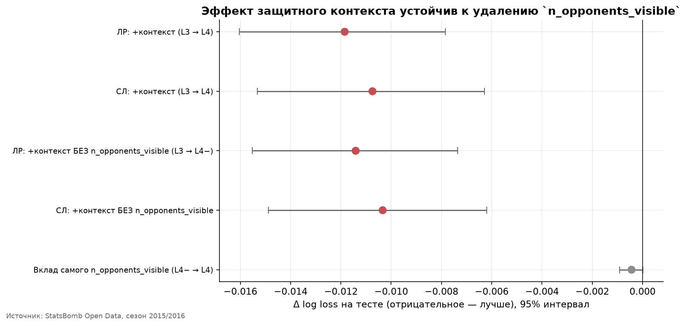

# Насколько защитный контекст улучшает модель Expected Goals?

Построение и сравнение футбольных xG-моделей на основе геометрии удара,
характеристик момента и расположения защитников и вратаря в StatsBomb Open Data.

Пет-проект для ИАД ОГО, Бюрчиев Тимур, БПИ 248. Версия 1.0.0.

## Исследовательский вопрос

> Какую дополнительную прогностическую ценность даёт расположение защитников и
> вратаря по сравнению с моделью, которая знает только геометрию и характеристики удара?

Это исследование **качества прогнозирования**, а не причинности: утверждать,
что плотная оборона «вызывает» промах, на этих данных нельзя.

## Ключевой результат

На 37 488 непенальтистских ударах из 1517 матчей четырёх мужских топ-лиг сезона
2015/2016 добавление самостоятельно рассчитанных пространственных признаков обороны
улучшает log loss на **0.0119** у логистической регрессии и на **0.0107** у случайного
леса; 95% доверительные интервалы парного bootstrap по матчам целиком лежат ниже нуля.
Готовые контекстные флаги StatsBomb (`under_pressure`, `one_on_one`, `open_goal`)
обнаружимого дополнительного улучшения на этих данных **не дали** — интервал включает ноль.
Эффект защитного контекста сохраняется при удалении неоднозначного признака
`n_opponents_visible`, который смешивает плотность обороны с границами кадра камеры.
По сравнению с `statsbomb_xg` статистически устойчивого различия по log loss
не обнаружено, тогда как по Brier score `statsbomb_xg` устойчиво лучше.

| Модель | Признаки | Test log loss | Brier | ROC-AUC | PR-AUC | ECE |
| --- | --- | ---: | ---: | ---: | ---: | ---: |
| `statsbomb_xg` (benchmark) | — | **0.2404** | **0.0682** | **0.835** | **0.442** | 0.0168 |
| Логистическая регрессия | + защитный контекст | 0.2427 | 0.0692 | 0.830 | 0.425 | 0.0152 |
| Случайный лес | + защитный контекст | 0.2433 | 0.0694 | 0.830 | 0.422 | 0.0133 |
| Градиентный бустинг | без защитного контекста | 0.2523 | 0.0717 | 0.808 | 0.382 | 0.0064 |
| Логистическая регрессия | без защитного контекста | 0.2546 | 0.0721 | 0.802 | 0.380 | 0.0111 |
| Логистическая регрессия | только геометрия | 0.2728 | 0.0770 | 0.760 | 0.298 | 0.0104 |
| DummyClassifier | — | 0.3137 | 0.0859 | 0.500 | 0.095 | — |




## Данные и выборка

Единственный источник — официальный репозиторий
[StatsBomb Open Data](https://github.com/hudl/open-data), привязанный к неизменяемой
ревизии `b0bc9f22dd77c206ddedc1d742893b3bbe64baec`. Данные загружаются скриптом:
вручную скачивать ничего не нужно, репозиторий источника целиком не клонируется.

**Выборка:** La Liga, Premier League, Serie A и Ligue 1 сезона 2015/2016 —
1517 матчей, 37 488 непенальтистских ударов, доля голов 9.52%. Четыре лиги
рассматриваются как одна целевая популяция: ведущие европейские мужские лиги
одного сезона.

Из 37 888 событий удара исключены 400 пенальти. Неизвестных исходов, дубликатов
и ударов без координат не оказалось. `shot.freeze_frame` доступен у **100%** ударов,
вратарь распознан у 99.9%, `statsbomb_xg` заполнен у 100%. Защитного контекста
лишён ровно один удар из 37 488.

Полный аудит — [`reports/data_audit.md`](reports/data_audit.md),
источник и атрибуция — [`DATA_SOURCES.md`](DATA_SOURCES.md).

## Уровни признаков и модели

Признаки разделены на четыре группы, чтобы отделить **свой расчёт** от разметки провайдера:

| Уровень | Группа | Примеры | n |
| --- | --- | --- | ---: |
| L1 | Геометрия удара | `shot_distance`, `shot_angle` | 2 |
| L2 | Характеристики удара | часть тела, техника, тип, `is_first_time` | +5 |
| L3 | Готовые флаги StatsBomb | `under_pressure`, `one_on_one`, `open_goal` | +3 |
| L4 | Свой защитный контекст | расстояние до ближайшего соперника, счётчики в радиусах, соперники в конусе удара, геометрия вратаря | +14 |

Лестница моделей: **M0** `DummyClassifier` → **M1** логистическая регрессия на L1 →
**M2** логистическая на L3 → **M3** дерево решений, случайный лес, градиентный бустинг →
**M4** логистическая и лучшая нелинейная на L4 → **M5** `statsbomb_xg` как внешний benchmark.

## Экспериментальный дизайн

- **Единица анализа** — один удар. `is_goal = 1` только для исхода `Goal`;
  неизвестный исход — ошибка данных, а не молчаливый ноль.
- **Разбиение** 70/15/15 по `match_id`: удары одного матча никогда не попадают
  в разные части. Доли четырёх лиг расходятся не более чем на 0.3 п.п.,
  доли голов — на 0.07 п.п. Тестовые `shot_id` зафиксированы один раз.
- **Никакого leakage:** `statsbomb_xg`, исход, `end_location`, идентичность игрока,
  команды и лиги в признаки не попадают. Проверка — `assert_no_forbidden_columns`
  и 12 автоматических проверок изоляции, которые пересчитываются при каждом запуске.
- **Дисбаланс классов не компенсируется:** ни SMOTE, ни oversampling, ни
  `class_weight="balanced"` — перевзвешивание смещает вероятности.
- **Главные метрики** — log loss и калибровка; ROC-AUC и PR-AUC дополняют, но не заменяют их.
- **Неопределённость** — парный bootstrap с ресемплингом **матчей**, а не ударов.

## Результаты ablation

Все уровни обучены на одних и тех же строках, одном разбиении и одной предобработке;
каждый следующий строго добавляет признаки к предыдущему.

| Шаг | Δ log loss | 95% интервал | Устойчиво |
| --- | ---: | --- | --- |
| L1 → L2: + характеристики удара | −0.0165 | [−0.0208; −0.0119] | да |
| L2 → L3: + готовые флаги StatsBomb | −0.0017 | [−0.0035; +0.0002] | **нет** |
| L3 → L4: + свой защитный контекст (логистическая) | −0.0119 | [−0.0160; −0.0078] | **да** |
| L3 → L4: + свой защитный контекст (случайный лес) | −0.0107 | [−0.0153; −0.0063] | **да** |

Что этот результат означает и чего **не** означает: готовые флаги не дали
обнаружимого дополнительного улучшения, тогда как самостоятельно рассчитанные
пространственные признаки дали устойчивый прирост. Это два отдельных сравнения,
а не тест на исключительность вклада, поэтому утверждать, что прирост
«принадлежит именно нашей геометрии», нельзя.

**Sensitivity test.** Признак `n_opponents_visible` неоднозначен: он кодирует
и плотность обороны, и границы поля зрения камеры. Модель обучена повторно без него —
на тех же строках, том же разбиении и той же процедуре. Эффект сохраняется:
−0.0114 [−0.0155; −0.0074] у логистической регрессии и −0.0103 [−0.0149; −0.0062]
у случайного леса. Собственный вклад самого признака мал: −0.00044 по log loss,
интервал включает ноль.

**Нелинейность почти не помогает:** логистическая регрессия с защитным контекстом
не уступает случайному лесу. Основную информацию несут признаки, а не форма модели.

## Сравнение со `statsbomb_xg`

Разница «наша лучшая модель минус `statsbomb_xg`»: **+0.0028 log loss**,
интервал [−0.0009; +0.0065] — включает ноль, поэтому **статистически устойчивого
различия по log loss не обнаружено**. Это не означает, что модели равны:
при данном объёме теста (5639 ударов, 224 матча) различие такого размера просто
неотличимо от нуля.

По **Brier score `statsbomb_xg` устойчиво лучше**: разница +0.0012,
интервал [+0.0003; +0.0022] целиком положителен.

Сравнение не равное по условиям: StatsBomb обучает модель на закрытых данных
большего объёма и собственным процессом. Проект не обязан её превосходить.

## Анализ лиг и ошибок

Сырой log loss между лигами сравнивать нельзя: он механически ниже там, где реже
забивают. Основной вывод строится на относительном качестве внутри лиги —
Brier Skill Score относительно `DummyClassifier` на тех же строках.

| Лига | Доля голов | Log loss | BSS без контекста | BSS с контекстом | Прирост BSS |
| --- | ---: | ---: | ---: | ---: | ---: |
| Serie A | 8.48% | 0.2155 | 0.1725 | 0.2189 | +0.046 |
| La Liga | 10.65% | 0.2600 | 0.1436 | 0.1913 | +0.048 |
| Premier League | 9.20% | 0.2421 | 0.1589 | 0.1887 | +0.030 |
| Ligue 1 | 9.74% | 0.2563 | 0.1690 | 0.1775 | +0.009 |

Размах BSS между лигами — 0.041, то есть модель работает в четырёх лигах
сопоставимо, и объединение их в одну популяцию оправдано. Защитный контекст
помогает во всех четырёх лигах, но в Ligue 1 заметно слабее.

Защитный контекст сильнее всего улучшает прогноз там, где и должен: когда вратарь
вышел из ворот (+0.022 log loss), на средней дистанции (+0.018) и на ближних
ударах (+0.015). На дальних ударах и очень острых углах прирост мал.

Полные таблицы, графики и разбор отдельных ударов — в
[`reports/results.md`](reports/results.md).

## Ограничения

- `shot.freeze_frame` показывает только игроков, попавших в кадр: в среднем видно
  7.5 соперника вместо десяти. Все счётчики означают «сколько **видно**».
- Исследование отвечает на вопрос о качестве прогноза, а не о причинности.
- Отсутствие обнаружимого эффекта у флагов StatsBomb не доказывает, что вклад
  принадлежит исключительно нашим признакам.
- Выборка — четыре европейские мужские лиги одного сезона; перенос выводов
  на другие лиги, эпохи или женский футбол не обоснован.
- Все лиги относятся к одному сезону, поэтому временной holdout невозможен;
  устойчивость проверяется разрезом по лигам.
- Сравнение со `statsbomb_xg` не равное по условиям.
- Подгруппы в анализе ошибок пересекаются и выбраны после просмотра данных;
  доверительных интервалов для них нет.
- Коэффициенты интерпретируются с осторожностью: защитные признаки коллинеарны.

## Воспроизведение

**Python 3.11 или 3.12.** Проект работает на обычном ноутбуке: ни GPU, ни базы
данных, ни облака не требуется.

### Установка

```bash
python -m venv .venv
```

```bash
.venv/Scripts/python.exe -m pip install -e ".[dev]"
```

На Linux и macOS вместо `.venv/Scripts/python.exe` используется `.venv/bin/python`.

### Быстрая проверка (без загрузки данных)

Тесты, включая smoke-тест полного пайплайна на синтетических событиях:

```bash
pytest -q && ruff check . && ruff format --check .
```

Оценка объёма загрузки без скачивания:

```bash
python scripts/download_data.py --config configs/data.yaml --selection --dry-run
```

### Полный пайплайн

```bash
python scripts/download_data.py --config configs/data.yaml --selection
```

```bash
python scripts/build_dataset.py --config configs/data.yaml
```

```bash
python scripts/audit_data.py --selection
```

```bash
python scripts/run_experiments.py --config configs/experiment.yaml
```

```bash
python scripts/make_report.py
```

### Сколько это стоит по ресурсам

| Ресурс | Значение |
| --- | --- |
| Загрузка событий выборки | **4.52 ГБ** (1517 файлов) |
| Кеш `data/raw/` после загрузки | около 4.9 ГБ |
| Обработанный датасет `data/processed/` | около 25 МБ |
| Итого свободного места | **не менее 6 ГБ** |
| Время загрузки | около 3 минут при 25 МБ/с |
| Построение датасета | около 2.5 минут |
| Лестница моделей и bootstrap | около 20 минут |
| Отчёт и графики | около 15 секунд |

Загрузка кешируется: повторный запуск ничего не скачивает заново.
Предохранитель `--max-gb` (по умолчанию 5 ГБ) не даст случайно скачать больше.

### Что уже сохранено в репозитории

Результаты не нужно пересчитывать, чтобы их посмотреть — всё лежит в `reports/`:

- [`reports/results.md`](reports/results.md) — итоговый отчёт: таблицы моделей,
  ablation, bootstrap, sensitivity test, калибровка, лиги, анализ ошибок,
  аудит изоляции;
- [`reports/data_audit.md`](reports/data_audit.md) — аудит данных по полной выборке;
- `reports/figures/` — 11 графиков;
- `reports/tables/` — 30 CSV/JSON-таблиц со всеми числами;
- `data/data_manifest.json` — ревизия источника, хеш списка `match_id`,
  журнал фильтрации и SHA-256 датасета;
- `notebooks/` — пять исполненных ноутбуков с сохранёнными выводами.

Сырые и обработанные данные в репозиторий не входят.

## Структура репозитория

```text
src/xg_context/      переиспользуемая логика
  config.py          константы поля, схема StatsBomb, списки признаков
  data.py            загрузчик с кешем и инвентаризацией источника
  dataset.py         разбор событий, фильтры, признаки
  audit.py           аудит доступности данных
  geometry.py        геометрия удара и защитного контекста
  features.py        target mapping и защита от leakage
  splitting.py       групповое разбиение по match_id
  preprocessing.py   ColumnTransformer и Pipeline
  models.py          лестница моделей и подбор гиперпараметров
  evaluation.py      метрики, калибровка, парный bootstrap
  visualization.py   графики с русскими подписями
  reporting.py       сборка markdown-отчётов
scripts/             воспроизводимые точки входа
configs/             data.yaml и experiment.yaml
notebooks/           пять ноутбуков этапов 2-5
reports/             results.md, data_audit.md, figures/, tables/
tests/               213 тестов
data/                локальные данные, в Git не попадают (кроме манифеста)
```

## Источник данных и атрибуция

Данные предоставлены **StatsBomb** в рамках
[StatsBomb Open Data](https://github.com/hudl/open-data).

При использовании результатов необходимо указывать StatsBomb как источник данных
и соблюдать условия StatsBomb Open Data (файл `LICENSE.pdf` в репозитории
источника). Лицензия кода этого проекта — [MIT](LICENSE) — распространяется
только на код и **не заменяет** условия использования данных.

Полный исходный датасет внутри этого репозитория не распространяется:
загружается локально скриптом и исключён из Git.

> Данные предоставлены StatsBomb (StatsBomb Open Data).

## Дальнейшая работа

Сознательно **не входит** в версию 1.0 и остаётся возможным развитием:
leave-one-league-out проверка переносимости между лигами, эксперимент с PCA
на стандартизированных пространственных признаках, нейросетевая модель,
признаки StatsBomb 360. Подробности — в [`DECISIONS.md`](DECISIONS.md).
