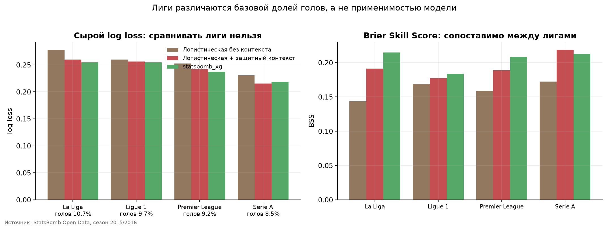

# Результаты: насколько защитный контекст улучшает xG

> Файл собирает `scripts/make_report.py` из таблиц в `reports/tables/`. Не редактируйте его вручную, правьте код и перезапускайте.

Выборка: 37 487 непенальтистских ударов из 1 517 матчей четырёх мужских топ-лиг сезона 2015/2016.

## 1. Разбиение

| Часть | Матчей | Ударов | Доля | Голов | Доля голов |
| --- | --- | --- | --- | --- | --- |
| train | 1 067 | 26 206 | 0.699 | 2 499 | 0.0954 |
| validation | 226 | 5 642 | 0.151 | 534 | 0.0946 |
| test | 224 | 5 639 | 0.150 | 535 | 0.0949 |

Разбиение идёт по `match_id`: удары одного матча не попадают в разные части. Тестовые `shot_id` записаны в `data/processed/split.json` и для выбора признаков и гиперпараметров не использовались.

## 2. Итоговая таблица моделей

| Модель | Признаки | Val log loss | Test log loss | Brier | ROC-AUC | PR-AUC | ECE |
| --- | --- | --- | --- | --- | --- | --- | --- |
| statsbomb_xg (benchmark) | — | 0.2500 | 0.2404 | 0.0682 | 0.8346 | 0.4422 | 0.0168 |
| Логистическая регрессия | geometry_shot_flags_defensive | 0.2503 | 0.2427 | 0.0692 | 0.8300 | 0.4247 | 0.0152 |
| Логистическая регрессия | geometry_shot_flags_defensive_no_visible | 0.2500 | 0.2431 | 0.0694 | 0.8299 | 0.4222 | 0.0150 |
| Случайный лес | geometry_shot_flags_defensive | 0.2520 | 0.2433 | 0.0694 | 0.8296 | 0.4220 | 0.0133 |
| Случайный лес | geometry_shot_flags_defensive_no_visible | 0.2518 | 0.2437 | 0.0697 | 0.8295 | 0.4168 | 0.0115 |
| Градиентный бустинг | geometry_shot_flags | 0.2569 | 0.2523 | 0.0717 | 0.8083 | 0.3816 | 0.0064 |
| Случайный лес | geometry_shot_flags | 0.2568 | 0.2540 | 0.0722 | 0.8049 | 0.3752 | 0.0092 |
| Логистическая регрессия | geometry_shot_flags | 0.2552 | 0.2546 | 0.0721 | 0.8022 | 0.3797 | 0.0111 |
| Логистическая регрессия | geometry_shot | 0.2577 | 0.2563 | 0.0727 | 0.8007 | 0.3681 | 0.0101 |
| Случайный лес | geometry_shot | 0.2620 | 0.2578 | 0.0736 | 0.8017 | 0.3573 | 0.0128 |
| Дерево решений | geometry_shot_flags | 0.2657 | 0.2600 | 0.0737 | 0.7851 | 0.3171 | 0.0067 |
| Случайный лес | geometry | 0.2751 | 0.2721 | 0.0774 | 0.7598 | 0.2833 | 0.0062 |
| Логистическая регрессия | geometry | 0.2732 | 0.2728 | 0.0770 | 0.7597 | 0.2982 | 0.0104 |
| DummyClassifier | geometry | 0.3132 | 0.3137 | 0.0859 | 0.5000 | 0.0949 | н/д |

Лучшая нелинейная модель выбрана по validation: random_forest. ECE это взвешенная по размеру бина средняя ошибка калибровки.

## 3. Ablation: вклад каждой группы признаков

Все уровни обучены на одних и тех же строках, одном разбиении и одной предобработке. Каждый следующий уровень строго добавляет признаки к предыдущему.

| Уровень | Что добавлено | Модель | n | Test log loss | Brier | ROC-AUC | Δ на шаге |
| --- | --- | --- | --- | --- | --- | --- | --- |
| L1 | геометрия удара | Логистическая регрессия | 2 | 0.2728 | 0.0770 | 0.7597 | н/д |
| L2 | + характеристики удара | Логистическая регрессия | 7 | 0.2563 | 0.0727 | 0.8007 | -0.01653 |
| L3 | + флаги StatsBomb | Логистическая регрессия | 10 | 0.2546 | 0.0721 | 0.8022 | -0.00173 |
| L4 | + свой защитный контекст | Логистическая регрессия | 24 | 0.2427 | 0.0692 | 0.8300 | -0.01185 |
| L1 | геометрия удара | Случайный лес | 2 | 0.2721 | 0.0774 | 0.7598 | н/д |
| L2 | + характеристики удара | Случайный лес | 7 | 0.2578 | 0.0736 | 0.8017 | -0.01423 |
| L3 | + флаги StatsBomb | Случайный лес | 10 | 0.2540 | 0.0722 | 0.8049 | -0.00383 |
| L4 | + свой защитный контекст | Случайный лес | 24 | 0.2433 | 0.0694 | 0.8296 | -0.01075 |

## 4. Неопределённость: парный bootstrap по матчам

| Сравнение | Δ log loss | CI низ | CI верх | Δ Brier | CI низ | CI верх |
| --- | --- | --- | --- | --- | --- | --- |
| Логистическая: + характеристики удара (L1 → L2) | -0.01653 | -0.02085 | -0.01186 | -0.00432 | -0.00557 | -0.00295 |
| Логистическая: + флаги StatsBomb (L2 → L3) | -0.00173 | -0.00350 | +0.00021 | -0.00058 | -0.00118 | +0.00003 |
| Логистическая: + защитный контекст (L3 → L4) | -0.01185 | -0.01603 | -0.00784 | -0.00287 | -0.00410 | -0.00166 |
| Случайный лес: + защитный контекст (L3 → L4) | -0.01075 | -0.01532 | -0.00629 | -0.00278 | -0.00421 | -0.00160 |
| Логистическая: + защитный контекст БЕЗ n_opponents_visible (L3 → L4−) | -0.01141 | -0.01553 | -0.00736 | -0.00268 | -0.00388 | -0.00147 |
| Случайный лес: + защитный контекст БЕЗ n_opponents_visible | -0.01034 | -0.01489 | -0.00620 | -0.00255 | -0.00393 | -0.00137 |
| Вклад самого n_opponents_visible (L4− → L4) | -0.00044 | -0.00091 | +0.00002 | -0.00019 | -0.00034 | -0.00004 |
| Логистическая с защитным контекстом против statsbomb_xg | +0.00229 | -0.00089 | +0.00522 | +0.00098 | +0.00004 | +0.00188 |

Ресемплируются матчи, а не удары: удары одного матча зависимы. 1000 итераций, 95% интервал. Отрицательная разница означает, что кандидат лучше.

Главный результат: защитный контекст улучшает log loss в среднем на 0.01130 по двум моделям. Интервалы целиком ниже нуля, улучшение устойчиво на этих данных.

Готовые флаги StatsBomb дают -0.00173 log loss, интервал [-0.00350; +0.00021]. Интервал включает ноль: обнаружимого прироста они не дали. Это не доказывает, что весь прирост принадлежит моим признакам, потому что это два отдельных сравнения.

## 5. Sensitivity test: признак `n_opponents_visible`

Признак считает соперников в кадре, поэтому отражает и плотность обороны, и границы поля зрения камеры. Модель обучена дважды, с ним и без него, на тех же строках и том же разбиении.

| Модель | L3 (без контекста) | L4− (без visible) | L4 (полный) | Brier L4− | Brier L4 |
| --- | --- | --- | --- | --- | --- |
| Логистическая регрессия | 0.2546 | 0.2431 | 0.2427 | 0.0694 | 0.0692 |
| Случайный лес | 0.2540 | 0.2437 | 0.2433 | 0.0697 | 0.0694 |

Эффект защитного контекста сохраняется и без этого признака: интервалы по-прежнему ниже нуля.

Собственный вклад признака: -0.00044 log loss, интервал [-0.00091; +0.00002]. По log loss устойчивого вклада нет, по Brier score он мал, но устойчив. Это около 4% общего прироста.

Читать этот признак как «плотность обороны» всё равно нельзя: он кодирует ещё и то, сколько игроков попало в кадр.

## 6. Сравнение со `statsbomb_xg`

Сравнивается основная модель проекта: логистическая регрессия с защитным контекстом. У неё log loss ниже, чем у случайного леса. Разница «логистическая минус `statsbomb_xg`» составляет +0.00229 log loss, интервал [-0.00089; +0.00522]. Интервал включает ноль, устойчивого различия по log loss нет. Это не значит, что модели равны: при 5 639 тестовых ударах различие такого размера неотличимо от нуля.

По Brier score `statsbomb_xg` устойчиво лучше: +0.00098, интервал [+0.00004; +0.00188].

Сравнение неравное: StatsBomb обучает модель на закрытых данных большего объёма.

## 7. Калибровка

ECE каждой модели есть в таблице раздела 2, бины квантильные. Полная разбивка по бинам лежит в `reports/tables/calibration_summary.csv`.

## 8. Метрики по лигам

Сырой log loss между лигами сравнивать нельзя: он ниже там, где реже забивают. Поэтому качество считается относительно `DummyClassifier` на тех же строках. Skill это доля снятого log loss, BSS это Brier Skill Score.

| Лига | Модель | Ударов | Доля голов | Log loss | Skill | Brier | BSS | ROC-AUC |
| --- | --- | --- | --- | --- | --- | --- | --- | --- |
| La Liga | Логистическая + защитный контекст | 1 361 | 0.1065 | 0.2600 | 0.2351 | 0.0771 | 0.1913 | 0.8460 |
| La Liga | Логистическая без контекста | 1 361 | 0.1065 | 0.2782 | 0.1817 | 0.0816 | 0.1436 | 0.8091 |
| La Liga | statsbomb_xg | 1 361 | 0.1065 | 0.2543 | 0.2518 | 0.0748 | 0.2148 | 0.8561 |
| Ligue 1 | Логистическая + защитный контекст | 1 314 | 0.0974 | 0.2563 | 0.1975 | 0.0723 | 0.1775 | 0.8033 |
| Ligue 1 | Логистическая без контекста | 1 314 | 0.0974 | 0.2596 | 0.1872 | 0.0731 | 0.1690 | 0.7909 |
| Ligue 1 | statsbomb_xg | 1 314 | 0.0974 | 0.2547 | 0.2027 | 0.0717 | 0.1841 | 0.8081 |
| Premier League | Логистическая + защитный контекст | 1 478 | 0.0920 | 0.2421 | 0.2120 | 0.0678 | 0.1887 | 0.8108 |
| Premier League | Логистическая без контекста | 1 478 | 0.0920 | 0.2525 | 0.1783 | 0.0703 | 0.1589 | 0.7844 |
| Premier League | statsbomb_xg | 1 478 | 0.0920 | 0.2373 | 0.2278 | 0.0662 | 0.2084 | 0.8190 |
| Serie A | Логистическая + защитный контекст | 1 486 | 0.0848 | 0.2155 | 0.2595 | 0.0607 | 0.2189 | 0.8537 |
| Serie A | Логистическая без контекста | 1 486 | 0.0848 | 0.2306 | 0.2077 | 0.0643 | 0.1725 | 0.8168 |
| Serie A | statsbomb_xg | 1 486 | 0.0848 | 0.2183 | 0.2500 | 0.0612 | 0.2127 | 0.8470 |

Сырой log loss минимален в лиге Serie A (0.2155), но это следствие низкой доли голов (0.0848). По относительному качеству картина другая: наибольший BSS у лиги Serie A (0.2189), наименьший у Ligue 1 (0.1775), размах 0.0414. Разброс небольшой. Это не доказывает, что четыре лиги можно считать одной популяцией, а значит только, что заметной разницы в качестве модели на этих данных не видно. Точечная оценка BSS выросла во всех четырёх лигах. Слабее всего прирост в лиге Ligue 1 (+0.008), сильнее всего в La Liga (+0.048). Доверительные интервалы отдельно по лигам не считались, поэтому устойчивость прироста внутри лиги не проверена.

## 9. Анализ ошибок по подгруппам

| Подгруппа | Ударов | Доля голов | Без контекста | С контекстом | statsbomb_xg | Улучшение |
| --- | --- | --- | --- | --- | --- | --- |
| Удары головой | 958 | 0.1117 | 0.3046 | 0.2993 | 0.3006 | +0.00531 |
| Удары ногой | 4 663 | 0.0905 | 0.2434 | 0.2302 | 0.2269 | +0.01320 |
| Острый угол (< 15°) | 1 439 | 0.0153 | 0.0830 | 0.0802 | 0.0802 | +0.00280 |
| Центральная позиция (> 30°) | 1 426 | 0.2090 | 0.4313 | 0.4175 | 0.4153 | +0.01375 |
| Ближние удары (< 12 единиц) | 1 319 | 0.2130 | 0.4392 | 0.4240 | 0.4218 | +0.01519 |
| Средняя дистанция (12–20) | 1 648 | 0.1062 | 0.3104 | 0.2922 | 0.2828 | +0.01821 |
| Дальние удары (> 20 единиц) | 2 672 | 0.0296 | 0.1290 | 0.1227 | 0.1247 | +0.00627 |
| Open play | 5 375 | 0.0967 | 0.2562 | 0.2441 | 0.2410 | +0.01216 |
| Стандарты | 264 | 0.0568 | 0.2209 | 0.2153 | 0.2297 | +0.00560 |
| Открытый момент (0 в конусе) | 2 694 | 0.1411 | 0.3315 | 0.3165 | 0.3095 | +0.01504 |
| Плотная оборона (2+ в конусе) | 973 | 0.0473 | 0.1807 | 0.1746 | 0.1801 | +0.00609 |
| Под давлением | 1 528 | 0.0962 | 0.2680 | 0.2594 | 0.2533 | +0.00860 |
| Без давления | 4 111 | 0.0944 | 0.2496 | 0.2365 | 0.2357 | +0.01306 |
| Ближайший соперник < 2 единиц | 2 330 | 0.1004 | 0.2716 | 0.2604 | 0.2561 | +0.01123 |
| Ближайший соперник > 5 единиц | 827 | 0.0810 | 0.2220 | 0.2076 | 0.2080 | +0.01435 |
| Вратарь вышел (> 3 единиц) | 1 652 | 0.1441 | 0.3533 | 0.3310 | 0.3266 | +0.02237 |

Подгруппы пересекаются и выбраны после просмотра данных. Доверительных интервалов для них нет, поэтому таблица показывает, где сосредоточено улучшение, но гипотез не проверяет.

## 10. Примеры ударов

| Почему выбран | Лига | Гол | Расстояние | В конусе | Ближайший | Без контекста | С контекстом | statsbomb_xg |
| --- | --- | --- | --- | --- | --- | --- | --- | --- |
| контекст сильно повысил прогноз | La Liga | 1 | 13.1 | 0.0000 | 4.8 | 0.2323 | 0.8215 | 0.7512 |
| контекст сильно повысил прогноз | La Liga | 0 | 18.4 | 0.0000 | 8.7 | 0.1101 | 0.6676 | 0.3782 |
| контекст сильно понизил прогноз | Serie A | 0 | 39.6 | 0.0000 | 16.8 | 0.5260 | 0.0972 | 0.0002 |
| контекст сильно понизил прогноз | Ligue 1 | 0 | 7.9 | 1 | 1.1 | 0.5121 | 0.2699 | 0.0886 |
| мы выше statsbomb_xg | La Liga | 0 | 8.5 | 0.0000 | 6.3 | 0.7212 | 0.7469 | 0.3167 |
| мы выше statsbomb_xg | Ligue 1 | 0 | 16.1 | 0.0000 | 1.0 | 0.0808 | 0.4843 | 0.1656 |
| мы ниже statsbomb_xg | Serie A | 0 | 10.2 | 0.0000 | 2.2 | 0.2951 | 0.3254 | 0.7476 |
| мы ниже statsbomb_xg | Premier League | 1 | 8.3 | 0.0000 | 2.6 | 0.6323 | 0.5701 | 0.8917 |

Разбор одного случая. Удар с расстояния 39.6 почти с нулевым углом к воротам получил без защитного контекста вероятность 0.526 из-за флага `one_on_one`. Модель с контекстом снизила прогноз до 0.097, а `statsbomb_xg` равен 0.0002. Это не успех защитного контекста: обе мои модели ошибаются здесь на два порядка, и после снижения прогноз остаётся неразумным. Случай показывает слабость аддитивной модели, в которой бинарный флаг не может быть отменён геометрией.

## 11. Проверки изоляции

При каждом запуске из объектов эксперимента считаются 12 проверок. Все пройдены: части выборки не пересекаются, тестовые `shot_id` зафиксированы на диске, модель выбрана по validation, гиперпараметры подобраны внутри train, препроцессинг живёт внутри `Pipeline`, ablation-модели оценены на одних строках, запрещённые признаки в матрицу не попали, классы не перевзвешивались и пост-калибровки на тесте не было.

## 12. Данные и признаки

## 13. Ограничения

- `shot.freeze_frame` показывает только игроков в кадре. В среднем видно около 7.5 соперника вместо десяти, поэтому все счётчики означают «сколько видно».
- Работа отвечает на вопрос о качестве прогноза, а не о причинах.
- Отсутствие эффекта у флагов StatsBomb не доказывает, что вклад принадлежит только моим признакам.
- Выборка это четыре европейские мужские лиги одного сезона. Переносить выводы на другие лиги, эпохи или женский футбол нельзя.
- Все лиги относятся к одному сезону, поэтому проверка на другом сезоне невозможна.
- Сравнение со `statsbomb_xg` неравное по условиям.
- Флаги `one_on_one` и `open_goal` это разметка провайдера, а не мой расчёт.
- Защитные признаки коллинеарны, поэтому коэффициенты делят вклад между собой и читать их нужно осторожно.
- Подгруппы в анализе ошибок пересекаются и выбраны после просмотра данных.
