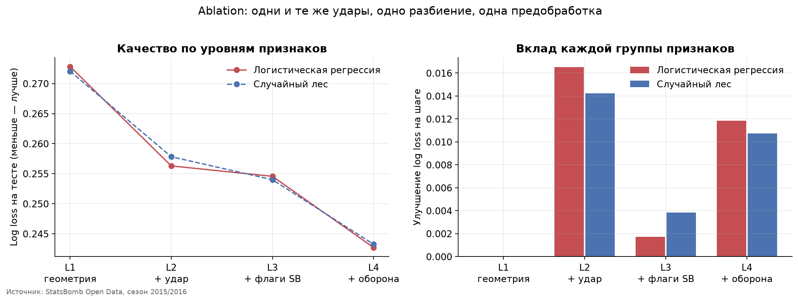
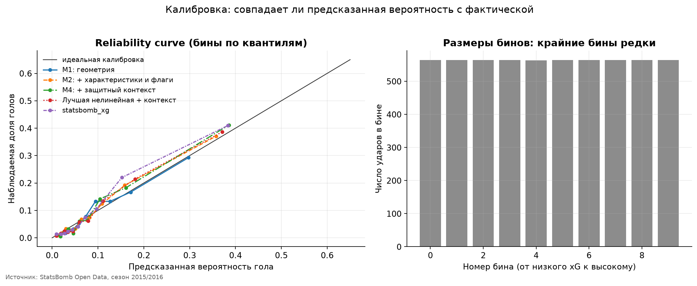
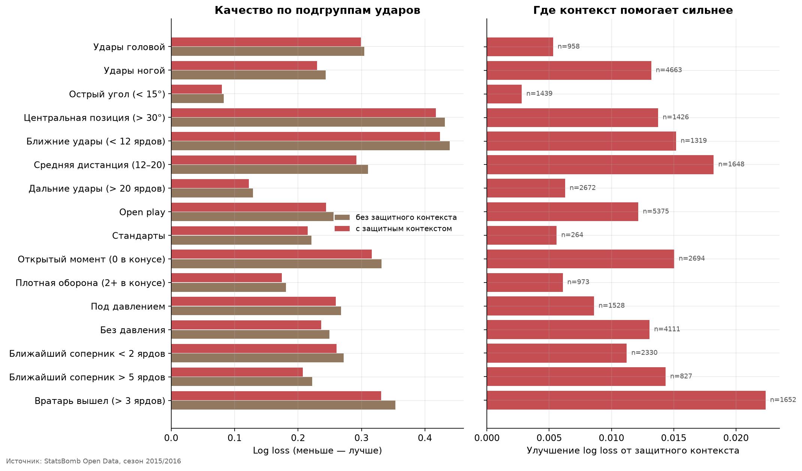
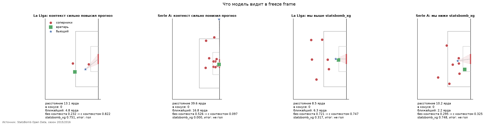
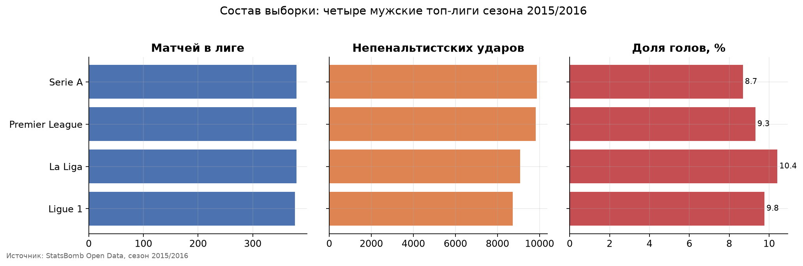
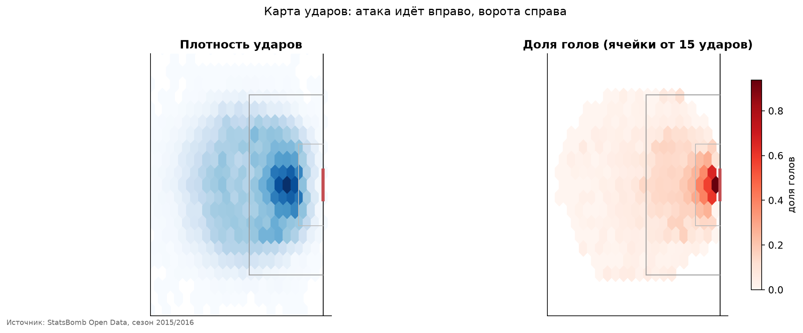
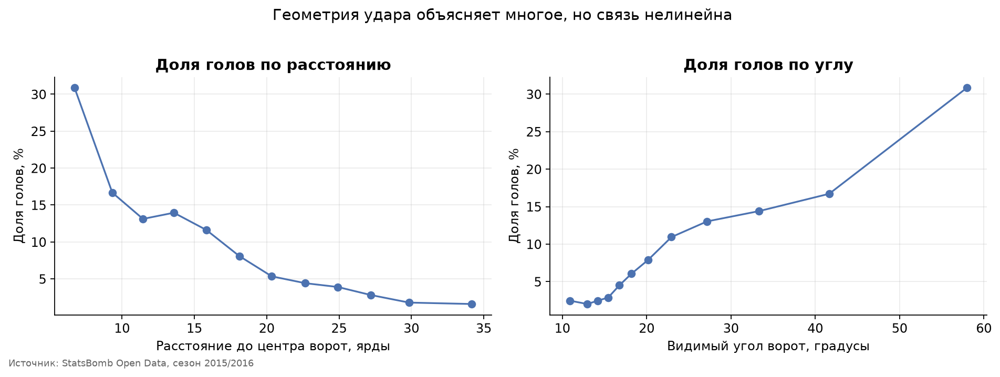
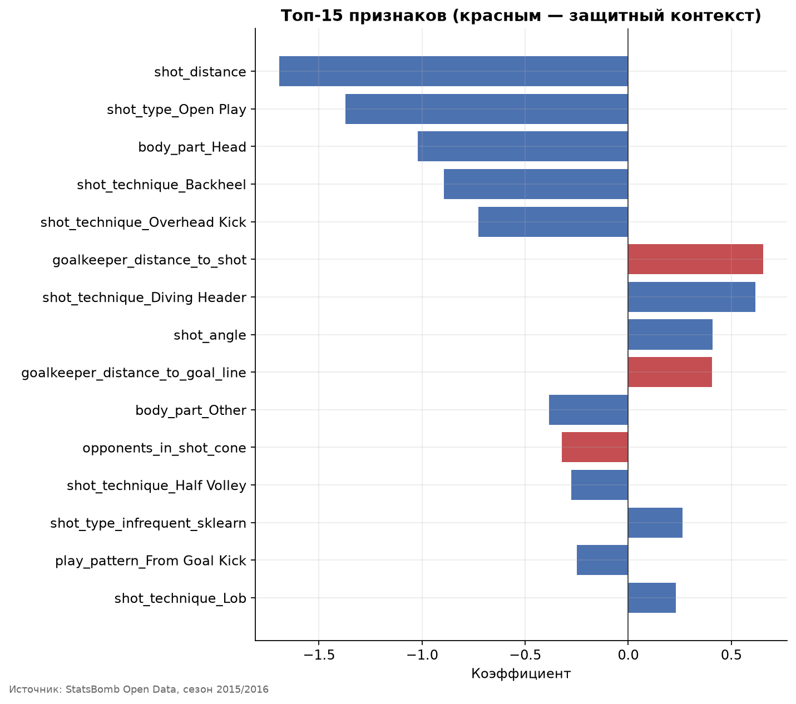
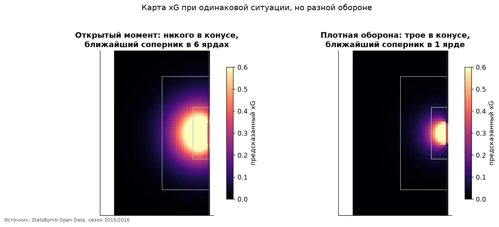

# Результаты: насколько защитный контекст улучшает xG

> Файл сгенерирован скриптом `scripts/make_report.py` из таблиц в `reports/tables/`. Не редактируйте его вручную — правьте код и перезапускайте.

Выборка: **37 487 непенальтистских ударов** из **1 517 матчей** четырёх мужских топ-лиг сезона 2015/2016 (La Liga, Premier League, Serie A, Ligue 1).

## 1. Разбиение

| Часть | Матчей | Ударов | Доля | Голов | Доля голов |
| --- | --- | --- | --- | --- | --- |
| train | 1 067 | 26 206 | 0.699 | 2 499 | 0.0954 |
| validation | 226 | 5 642 | 0.151 | 534 | 0.0946 |
| test | 224 | 5 639 | 0.150 | 535 | 0.0949 |

Разбиение выполнено по `match_id`: удары одного матча не попадают в разные части. Доли четырёх лиг и доля голов выровнены по построению. Тестовые `shot_id` зафиксированы в `data/processed/split.json` и не использовались ни для выбора признаков, ни для подбора гиперпараметров.

## 2. Итоговая таблица моделей

| Модель | Признаки | Val log loss | Test log loss | Brier | ROC-AUC | PR-AUC |
| --- | --- | --- | --- | --- | --- | --- |
| statsbomb_xg (benchmark) | — | 0.2500 | 0.2404 | 0.0682 | 0.8346 | 0.4422 |
| Логистическая регрессия | geometry_shot_flags_defensive | 0.2503 | 0.2427 | 0.0692 | 0.8300 | 0.4247 |
| Случайный лес | geometry_shot_flags_defensive | 0.2520 | 0.2433 | 0.0694 | 0.8296 | 0.4220 |
| Градиентный бустинг | geometry_shot_flags | 0.2569 | 0.2523 | 0.0717 | 0.8083 | 0.3816 |
| Случайный лес | geometry_shot_flags | 0.2568 | 0.2540 | 0.0722 | 0.8049 | 0.3752 |
| Логистическая регрессия | geometry_shot_flags | 0.2552 | 0.2546 | 0.0721 | 0.8022 | 0.3797 |
| Логистическая регрессия | geometry_shot | 0.2577 | 0.2563 | 0.0727 | 0.8007 | 0.3681 |
| Случайный лес | geometry_shot | 0.2620 | 0.2578 | 0.0736 | 0.8017 | 0.3573 |
| Дерево решений | geometry_shot_flags | 0.2657 | 0.2600 | 0.0737 | 0.7851 | 0.3171 |
| Случайный лес | geometry | 0.2751 | 0.2721 | 0.0774 | 0.7598 | 0.2833 |
| Логистическая регрессия | geometry | 0.2732 | 0.2728 | 0.0770 | 0.7597 | 0.2982 |
| DummyClassifier | geometry | 0.3132 | 0.3137 | 0.0859 | 0.5000 | 0.0949 |

Лучшая нелинейная модель выбрана по validation: **random_forest**. Тест использовался только для финальной оценки.

## 3. Ablation: вклад каждой группы признаков

Все четыре уровня обучены на **одних и тех же строках**, одном разбиении и одной предобработке. Каждый следующий уровень строго добавляет признаки к предыдущему, поэтому разницу метрик можно приписать именно им.

| Уровень | Что добавлено | Модель | n | Test log loss | Brier | ROC-AUC | Δ на шаге |
| --- | --- | --- | --- | --- | --- | --- | --- |
| L1 | геометрия удара | Логистическая регрессия | 2 | 0.2728 | 0.0770 | 0.7597 | н/д |
| L2 | + характеристики удара | Логистическая регрессия | 7 | 0.2563 | 0.0727 | 0.8007 | -0.01653 |
| L3 | + флаги StatsBomb | Логистическая регрессия | 10 | 0.2546 | 0.0721 | 0.8022 | -0.00173 |
| L4 | + свой защитный контекст | Логистическая регрессия | 24 | 0.2427 | 0.0692 | 0.8300 | -0.01185 |
| L1 | геометрия удара | Случайный лес | 2 | 0.2721 | 0.0774 | 0.7598 | н/д |
| L2 | + характеристики удара | Случайный лес | 7 | 0.2578 | 0.0736 | 0.8017 | -0.01423 |
| L3 | + флаги StatsBomb | Случайный лес | 10 | 0.2540 | 0.0722 | 0.8049 | -0.00383 |
| L4 | + свой защитный контекст | Случайный лес | 24 | 0.2433 | 0.0694 | 0.8296 | -0.01075 |

## 4. Неопределённость: парный bootstrap по матчам

| Сравнение | Δ log loss | CI низ | CI верх | Δ Brier | CI низ | CI верх |
| --- | --- | --- | --- | --- | --- | --- |
| Логистическая: + характеристики удара (L1 → L2) | -0.01653 | -0.02085 | -0.01186 | -0.00432 | -0.00557 | -0.00295 |
| Логистическая: + флаги StatsBomb (L2 → L3) | -0.00173 | -0.00350 | +0.00021 | -0.00058 | -0.00118 | +0.00003 |
| Логистическая: + защитный контекст (L3 → L4) | -0.01185 | -0.01603 | -0.00784 | -0.00287 | -0.00410 | -0.00166 |
| Случайный лес: + защитный контекст (L3 → L4) | -0.01075 | -0.01532 | -0.00629 | -0.00278 | -0.00421 | -0.00160 |
| Лучшая модель против statsbomb_xg | +0.00283 | -0.00092 | +0.00655 | +0.00120 | +0.00026 | +0.00215 |

Ресемплируются **матчи**, а не отдельные удары: удары одного матча зависимы. 1000 итераций, 95% интервал. Отрицательная разница означает, что модель-кандидат лучше.

**Главный результат исследования.** Добавление самостоятельно рассчитанного защитного контекста улучшает log loss в среднем на 0.01130 по двум моделям. Доверительный интервал целиком лежит ниже нуля для обеих моделей — улучшение статистически устойчиво, а не случайно.

**Отдельная находка.** Готовые контекстные флаги StatsBomb (`under_pressure`, `one_on_one`, `open_goal`) дают -0.00173 log loss, интервал [-0.00350; +0.00021]. Интервал включает ноль: сверх характеристик удара эти флаги измеримой ценности не добавляют. Это делает результат по собственному пространственному контексту содержательнее — он не дублирует разметку провайдера.

## 5. Сравнение со `statsbomb_xg`

Лучшая собственная модель отличается от `statsbomb_xg` на +0.00283 log loss, интервал [-0.00092; +0.00655].

По log loss интервал включает ноль: **различие статистически неубедительно**, модели сопоставимы.

По Brier score интервал целиком положителен: здесь `statsbomb_xg` устойчиво точнее нашей модели.

Сравнение не полностью равное: StatsBomb обучает модель на закрытых данных большего объёма и собственным процессом. Проект не обязан её превосходить (спецификация, разделы 11 и 23).

## 6. Калибровка

xG оценивается как вероятностная модель, поэтому калибровка важна не меньше различающей способности. ECE взвешен по размеру бина.

| Модель | Признаки | ECE | Средний прогноз | Факт |
| --- | --- | --- | --- | --- |
| Случайный лес | geometry | 0.0062 | 0.0945 | 0.0949 |
| Градиентный бустинг | geometry_shot_flags | 0.0064 | 0.0927 | 0.0949 |
| Дерево решений | geometry_shot_flags | 0.0067 | 0.0929 | 0.0949 |
| Случайный лес | geometry_shot_flags | 0.0092 | 0.0921 | 0.0949 |
| Логистическая регрессия | geometry_shot | 0.0101 | 0.0931 | 0.0949 |
| Логистическая регрессия | geometry | 0.0104 | 0.0952 | 0.0949 |
| Логистическая регрессия | geometry_shot_flags | 0.0111 | 0.0923 | 0.0949 |
| Случайный лес | geometry_shot | 0.0128 | 0.0931 | 0.0949 |
| Случайный лес | geometry_shot_flags_defensive | 0.0133 | 0.0936 | 0.0949 |
| Логистическая регрессия | geometry_shot_flags_defensive | 0.0152 | 0.0922 | 0.0949 |
| statsbomb_xg (benchmark) | — | 0.0168 | 0.0895 | 0.0949 |
| DummyClassifier | geometry | н/д | 0.0954 | 0.0949 |

## 7. Метрики по лигам

| Модель | Лига | Ударов | Доля голов | Log loss | Brier | ROC-AUC |
| --- | --- | --- | --- | --- | --- | --- |
| Логистическая регрессия | La Liga | 1 361 | 0.1065 | 0.2912 | 0.0850 | 0.7817 |
| Логистическая регрессия | Ligue 1 | 1 314 | 0.0974 | 0.2846 | 0.0802 | 0.7318 |
| Логистическая регрессия | Premier League | 1 478 | 0.0920 | 0.2740 | 0.0763 | 0.7335 |
| Логистическая регрессия | Serie A | 1 486 | 0.0848 | 0.2444 | 0.0676 | 0.7835 |
| Логистическая регрессия | La Liga | 1 361 | 0.1065 | 0.2782 | 0.0816 | 0.8091 |
| Логистическая регрессия | Ligue 1 | 1 314 | 0.0974 | 0.2596 | 0.0731 | 0.7909 |
| Логистическая регрессия | Premier League | 1 478 | 0.0920 | 0.2525 | 0.0703 | 0.7844 |
| Логистическая регрессия | Serie A | 1 486 | 0.0848 | 0.2306 | 0.0643 | 0.8168 |
| Логистическая регрессия | La Liga | 1 361 | 0.1065 | 0.2600 | 0.0771 | 0.8460 |
| Логистическая регрессия | Ligue 1 | 1 314 | 0.0974 | 0.2563 | 0.0723 | 0.8033 |
| Логистическая регрессия | Premier League | 1 478 | 0.0920 | 0.2421 | 0.0678 | 0.8108 |
| Логистическая регрессия | Serie A | 1 486 | 0.0848 | 0.2155 | 0.0607 | 0.8537 |
| Случайный лес | La Liga | 1 361 | 0.1065 | 0.2763 | 0.0813 | 0.8106 |
| Случайный лес | Ligue 1 | 1 314 | 0.0974 | 0.2638 | 0.0747 | 0.7855 |
| Случайный лес | Premier League | 1 478 | 0.0920 | 0.2524 | 0.0701 | 0.7858 |
| Случайный лес | Serie A | 1 486 | 0.0848 | 0.2266 | 0.0638 | 0.8300 |
| Случайный лес | La Liga | 1 361 | 0.1065 | 0.2573 | 0.0759 | 0.8467 |
| Случайный лес | Ligue 1 | 1 314 | 0.0974 | 0.2533 | 0.0722 | 0.8166 |
| Случайный лес | Premier League | 1 478 | 0.0920 | 0.2462 | 0.0690 | 0.8047 |
| Случайный лес | Serie A | 1 486 | 0.0848 | 0.2186 | 0.0616 | 0.8446 |
| statsbomb_xg (benchmark) | La Liga | 1 361 | 0.1065 | 0.2543 | 0.0748 | 0.8561 |
| statsbomb_xg (benchmark) | Ligue 1 | 1 314 | 0.0974 | 0.2547 | 0.0717 | 0.8081 |
| statsbomb_xg (benchmark) | Premier League | 1 478 | 0.0920 | 0.2373 | 0.0662 | 0.8190 |
| statsbomb_xg (benchmark) | Serie A | 1 486 | 0.0848 | 0.2183 | 0.0612 | 0.8470 |

## 8. Анализ ошибок по подгруппам

| Подгруппа | Ударов | Доля голов | Без контекста | С контекстом | statsbomb_xg | Улучшение |
| --- | --- | --- | --- | --- | --- | --- |
| Удары головой | 958 | 0.1117 | 0.3046 | 0.2993 | 0.3006 | +0.00531 |
| Удары ногой | 4 663 | 0.0905 | 0.2434 | 0.2302 | 0.2269 | +0.01320 |
| Острый угол (< 15°) | 1 439 | 0.0153 | 0.0830 | 0.0802 | 0.0802 | +0.00280 |
| Центральная позиция (> 30°) | 1 426 | 0.2090 | 0.4313 | 0.4175 | 0.4153 | +0.01375 |
| Ближние удары (< 12 ярдов) | 1 319 | 0.2130 | 0.4392 | 0.4240 | 0.4218 | +0.01519 |
| Средняя дистанция (12–20) | 1 648 | 0.1062 | 0.3104 | 0.2922 | 0.2828 | +0.01821 |
| Дальние удары (> 20 ярдов) | 2 672 | 0.0296 | 0.1290 | 0.1227 | 0.1247 | +0.00627 |
| Open play | 5 375 | 0.0967 | 0.2562 | 0.2441 | 0.2410 | +0.01216 |
| Стандарты | 264 | 0.0568 | 0.2209 | 0.2153 | 0.2297 | +0.00560 |
| Открытый момент (0 в конусе) | 2 694 | 0.1411 | 0.3315 | 0.3165 | 0.3095 | +0.01504 |
| Плотная оборона (2+ в конусе) | 973 | 0.0473 | 0.1807 | 0.1746 | 0.1801 | +0.00609 |
| Под давлением | 1 528 | 0.0962 | 0.2680 | 0.2594 | 0.2533 | +0.00860 |
| Без давления | 4 111 | 0.0944 | 0.2496 | 0.2365 | 0.2357 | +0.01306 |
| Ближайший соперник < 2 ярдов | 2 330 | 0.1004 | 0.2716 | 0.2604 | 0.2561 | +0.01123 |
| Ближайший соперник > 5 ярдов | 827 | 0.0810 | 0.2220 | 0.2076 | 0.2080 | +0.01435 |
| Вратарь вышел (> 3 ярдов) | 1 652 | 0.1441 | 0.3533 | 0.3310 | 0.3266 | +0.02237 |

## 9. Примеры ударов

| Почему выбран | Лига | Гол | Расстояние | В конусе | Ближайший | Без контекста | С контекстом | statsbomb_xg |
| --- | --- | --- | --- | --- | --- | --- | --- | --- |
| контекст сильно повысил прогноз | La Liga | 1 | 13.1 | 0.0000 | 4.8 | 0.2323 | 0.8215 | 0.7512 |
| контекст сильно повысил прогноз | La Liga | 0 | 18.4 | 0.0000 | 8.7 | 0.1101 | 0.6676 | 0.3782 |
| контекст сильно повысил прогноз | Premier League | 1 | 15.0 | 0.0000 | 2.7 | 0.4374 | 0.9377 | 0.9831 |
| контекст сильно понизил прогноз | Serie A | 0 | 39.6 | 0.0000 | 16.8 | 0.5260 | 0.0972 | 0.0002 |
| контекст сильно понизил прогноз | Ligue 1 | 0 | 7.9 | 1 | 1.1 | 0.5121 | 0.2699 | 0.0886 |
| контекст сильно понизил прогноз | La Liga | 0 | 4.2 | 2 | 0.9 | 0.5179 | 0.2810 | 0.2103 |
| мы выше statsbomb_xg | La Liga | 0 | 8.5 | 0.0000 | 6.3 | 0.7212 | 0.7469 | 0.3167 |
| мы выше statsbomb_xg | Ligue 1 | 0 | 16.1 | 0.0000 | 1.0 | 0.0808 | 0.4843 | 0.1656 |
| мы выше statsbomb_xg | Premier League | 0 | 5.7 | 0.0000 | 3.5 | 0.5985 | 0.5207 | 0.2145 |
| мы ниже statsbomb_xg | Serie A | 0 | 10.2 | 0.0000 | 2.2 | 0.2951 | 0.3254 | 0.7476 |
| мы ниже statsbomb_xg | Premier League | 1 | 8.3 | 0.0000 | 2.6 | 0.6323 | 0.5701 | 0.8917 |
| мы ниже statsbomb_xg | La Liga | 1 | 16.0 | 0.0000 | 4.0 | 0.1464 | 0.2822 | 0.5937 |

## 10. Данные и признаки

## 11. Ограничения

- `shot.freeze_frame` показывает только игроков, попавших в кадр: в среднем видно около 7.5 соперника, а не всех десятерых. Поэтому все счётчики — это «сколько соперников видно», и признак `n_opponents_visible` включён в модель именно чтобы она могла учесть неполноту кадра.
- Исследование отвечает на вопрос о качестве прогноза, а не о причинности. Нельзя утверждать, что плотная оборона «вызывает» промах.
- Выборка — четыре европейские мужские лиги одного сезона. Перенос выводов на другие лиги, эпохи или женский футбол не обоснован.
- Все четыре лиги относятся к сезону 2015/2016, поэтому временной holdout по сезонам невозможен; устойчивость проверяется разрезом по лигам.
- `statsbomb_xg` рассчитан на закрытых данных, поэтому сравнение с ним не является равным по условиям.
- Флаги `one_on_one` и `open_goal` — разметка провайдера, а не наш расчёт. Они вынесены в отдельный уровень ablation, чтобы не завышать вклад собственной геометрии.
- Коэффициенты логистической регрессии интерпретируются с осторожностью: защитные признаки коллинеарны между собой и делят вклад.
